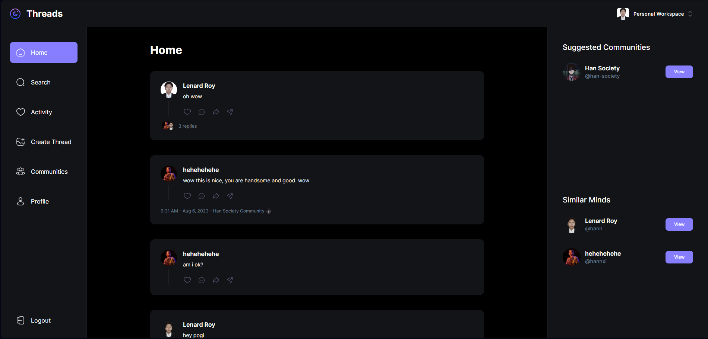

## Instagram New Threads Web Application

### Demo

You can access the live demo of the application at [https://instagram-threads.vercel.app/](https://instagram-threads.vercel.app/)

### Description

This web application is a clone of Instagram threads, allowing individuals to view and interact with newly released threads on Instagram. Users can create new posts, comment on existing posts, create communities, and delete their own posts. It has a simple UI/UX, making it user-friendly and easy to navigate.

### Features

- View newly released threads.
- Create new posts.
- Comment on existing posts.
- Create and manage communities.
- Delete your own posts.

### Technology used 

- MERN
- NextJS 13.4 with server-side rendering
- TypeScript
- Tailwind CSS
- Clerk (for authentication and web hooks)
- Shadcn-ui (for ui)
- UploadingThing (for image upload)
- Zod (For data validation)

